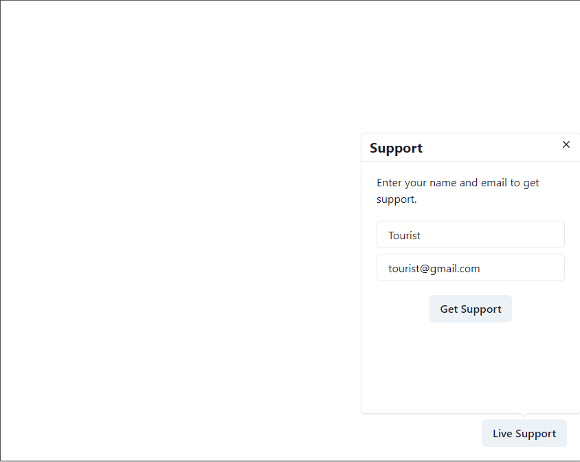
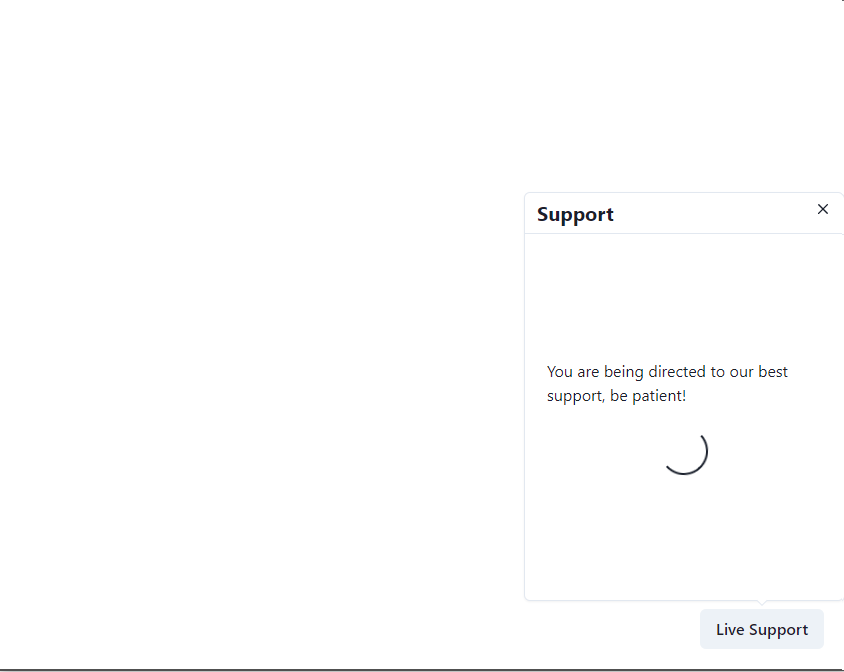
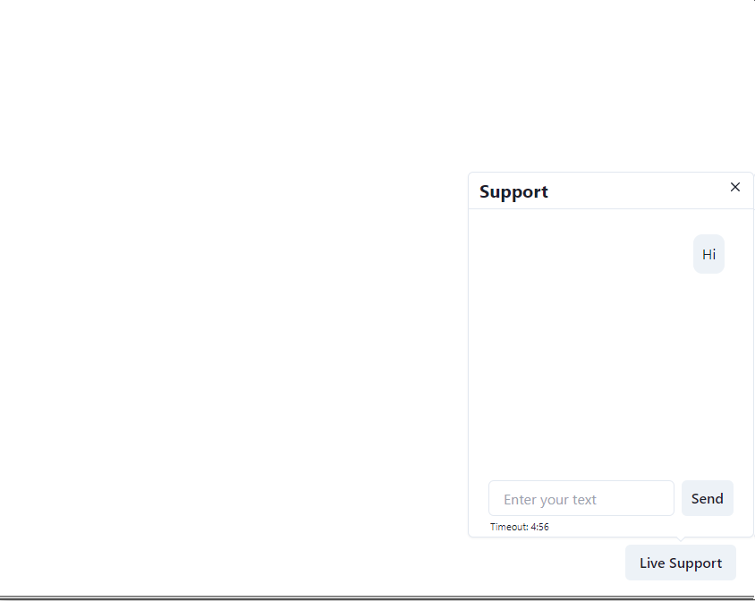
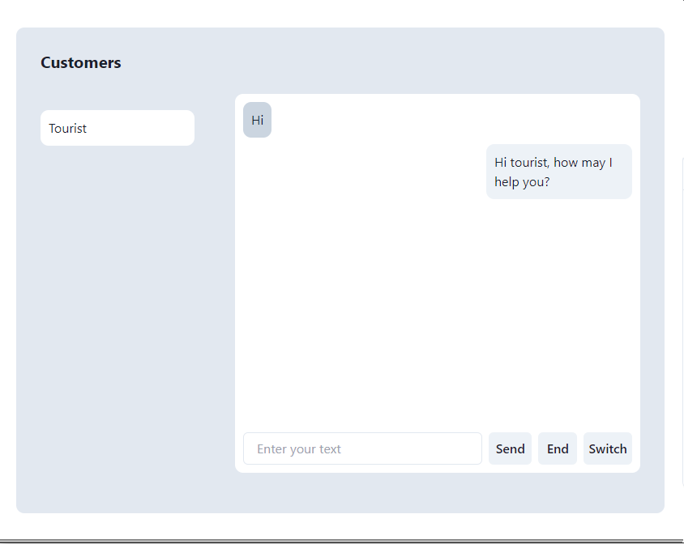
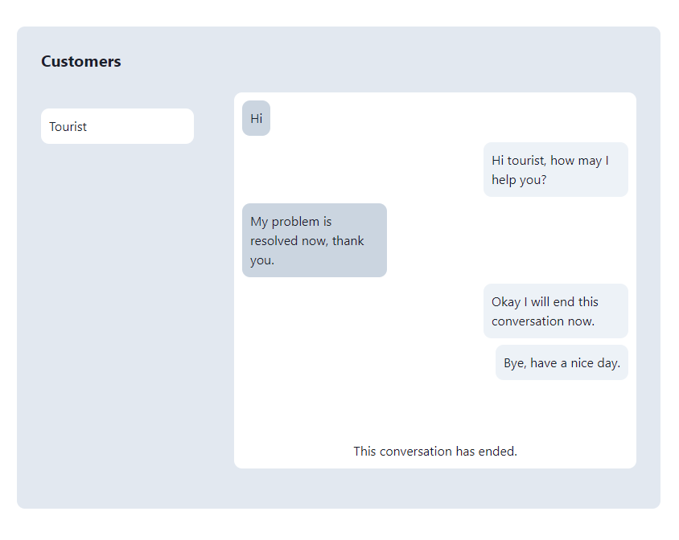
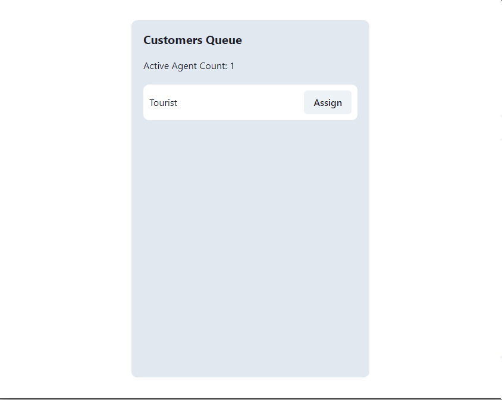
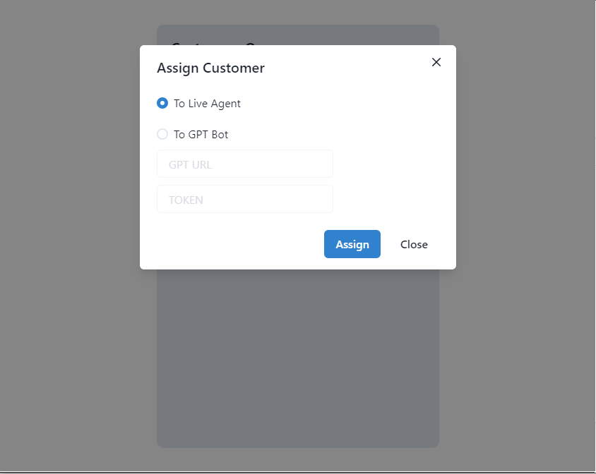

# Live Support Frontend

This is the repository for the frontend website I created for a QuickDesk Hiring Test. It consists of 3 routes for 3 different roles:

- Client at `/client`, as a client you can:

  1. Seek assistance from a live agent by clicking on the live support button located in the bottom right corner of the page. Once you click the button, you will be prompted to enter your email and name. After providing your email and name, you will be added to the customer queue and will be further assisted by a middle agent.
  2. Once you have been assigned an agent, you can start the conversation.

- Support Agent at `/support`, as a support agent you can:

  1. Engage in chat conversations with customers who have been assigned to you.
  2. End a conversation with the current customer when necessary.
  3. Switch the customer to the queue for re-assignment if required.
  4. Review past conversations you've had with customers.

- Middle Agent at `/mid`, as a middle agent you can:
  1. Assign customers in the queue to either a bot or a live agent. If you choose the live agent option, the system will assign the customer to a live agent with the least workload. If you opt for the bot option, you must provide the GPT API URL and the AuthToken for it to be used. Additionally, you cannot select the live agent option if there is currently no support agent that is active.
  2. Monitor the current count of active support agents.

# Tech Stacks

Next.js, Chakra-UI, Socket.io

# Instructions

If you want to launch this frontend website on your local machine, you need to use a `.env.local` file with variables listed below:

```
NEXT_PUBLIC_API_URL=http://localhost:3030 # your server url
```

# Screenshots

## Client





## Support Agent




## Middle Agent



